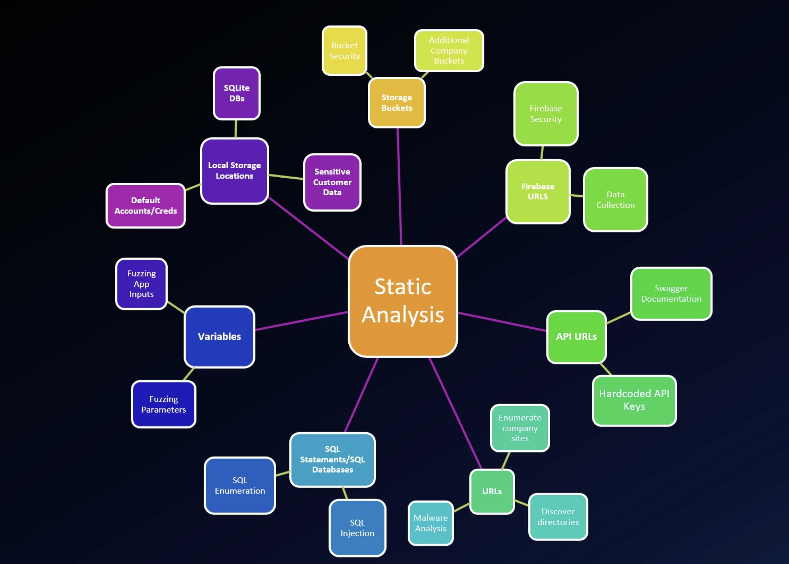

# Introduction

* Mobile app pentesting process:

  * Reconnaissance:

    * find info about company, mobile app
    * find target app on Play Store (or Apple store)
    * enumerate different app versions & patch notes

  * Static Analysis:

    * reading app source code via manual/automated tools
    * checking for hardcoded strings, security misconfigs in app
    * can trigger additional enumeration steps if useful data is found
    * 

  * Dynamic Analysis:

    * running the app and manipulating it
    * intercepting traffic with proxies like Burp Suite, Proxyman
    * dumping memory from the app to check for insecurely stored secrets
    * checking local storage for files created at runtime
    * can result in attacks related to OWASP Top Ten

  * Reporting:

    * contains executive summary, specific vulnerabilities discovered
    * provide criticality, steps to reproduce bug

* [Android Security Architecture](https://source.android.com/docs/security/overview/app-security):

  * Android is based on Linux (commands, file permissions, etc.).

  * Every app is run in a VM known as Android Runtime (ART) - Dalvik was the original runtime VM, but it is no longer utilized in modern Android OS.
  
  * ART is the modern translation layer from app's bytecode to device instructions; every app runs in its own sandboxed VM.

  * Similarly, in the file system, apps are isolated by creating a new user unique for that app.

  * For each app, the unique user is the owner of the app directory (UID between 10000 and 999999, with a similar username pattern).
  
  * This stops apps from interacting with each other unless explicitly granted permissions, or a ```Content Provider``` or a ```Broadcast Receiver``` is exposed.

  * Android also uses the concept of profiles - separated app data (Work profile, Personal profile, etc.) with access to system level functions, but it has isolated aspects for Data Loss Prevention.

  * Identity features such as Primary user, Secondary user, Guest user and Kid mode are also included.

  * Major layers in [Android Architecture](https://mobile-security.gitbook.io/mobile-security-testing-guide/android-testing-guide/0x05a-platform-overview):

    * 
    * Linux Kernel:

      * support for multiple CPU types, and 32-bit and 64-bit
      * apps are explicitly told which version of ART/API to run on
      * Android Manifest - minSDKVersion - higher version is more secure
      * But lower SDK/Android versions have more customers, and more security vulnerabilities
      * Access to physical components of Linux device are controlled by drivers

    * Hardware Abstraction Layer (HAL):

      * abstraction layer that allows apps to access hardware components irrespective of device manufacturer/type
      * newer HAL types include automotives, IoT, gaming peripherals

    * Libraries (Native C or ART):

      * C/C++ is the device's native language - it does not require a VM
      * Java (for ART) is easier to code in, so it is more preferred - newer apps are built in Kotlin

    * Java API Layer:

      * allows the app to interact with other apps, and also the device itself
      * content providers - way of sharing data to other apps via a specific directory (if exported) in the format ```content://<app-URI>/directory```
      * view system - used for making the app UI and normalizing it
      * managers - for running things such as notifications, telephony, package & location

    * System Apps:

      * pre-installed apps on Android device
      * can set a new default app to replace the vendor-supplied or system app

* App Security & Signing Process:

  * Every Android app can be reverse-engineered, rebuilt, re-signed and re-run.

  * The source code is available using tools like JADX-GUI or Apktool.

  * Integrity of apps can be ensured using app signing, which uses public-key cryptography
  
  * This includes 3 methods of verifying signatures - APK signature scheme v1, v2, v3; Google also implements Google Play signing.

* For setup, install ```adb```, ```apktool```, ```jadx-gui``` and ```Android Studio``` (preferably in host machine as Android Studio can crash VM).

* Within ```Android Studio```, tools like ```Device File Explorer```, ```Terminal```, ```Logcat``` and ```AVD Manager``` would be used often.

* Under ```AVD Manager```, we can choose a device which can pull APKs directly from Google Play - we can create 2 virtual devices, one with API level 29 (x86_64 arch preferred) and one with API level 23, for example, both supported by Google API.

* For devices with Google Play, the command ```adb root``` does not work; but for devices running images supported by Google API (the API level 23 one, for instance), ```adb root``` works as the device is already rooted - and we can run further commands on the device using ```adb shell```.
